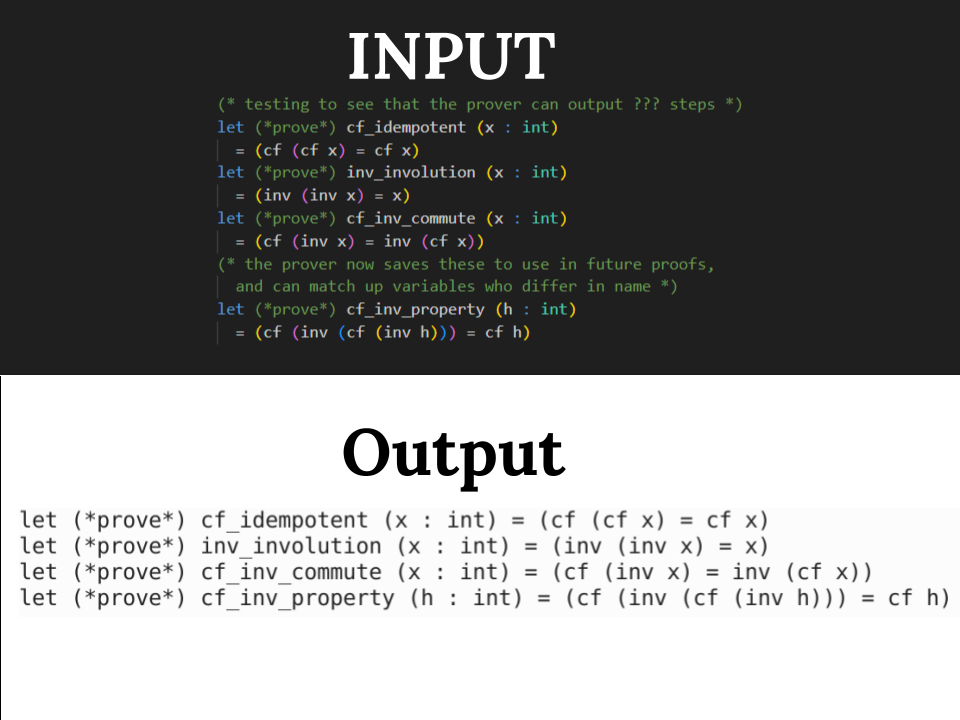
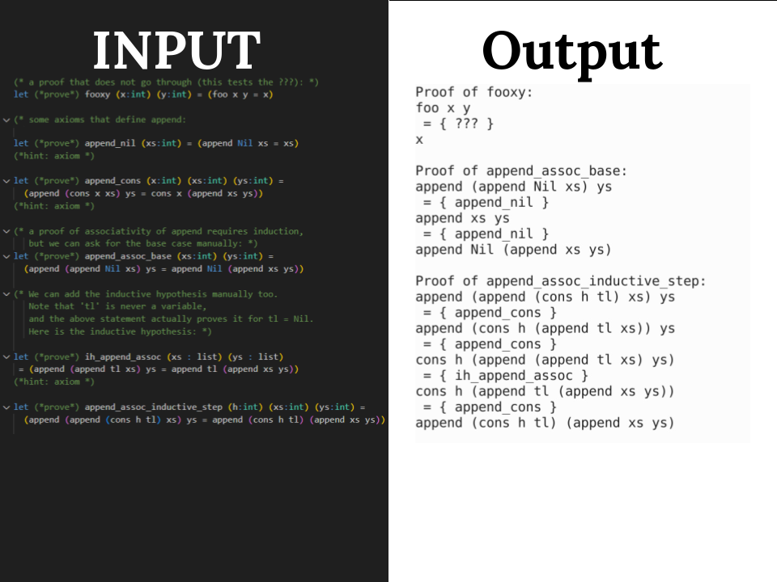

# Simple Function Prover

### Credits
This code was written by Nathaniel Grenke and Greta Brown as part of a school project. The base code is a solution that was given after having completed that section previously. The commit is soley our work. 

We've recieved instructor permission to share the code, but please do not plagurize! This code is very likey to be in plaguerism checkers.

## The Project
In the age of auto-generated code, it has become increasingly important for humans to prove their code work correctly. Resultantly, this project is a simple prover for Ocaml code. It can take in Axioms and apply them to prove statements. 

## How to run
This project was run on:
- A UMN CSE Lab machine running Linux
- Ocaml Ver 4.13.1
- Dune Build System

Installation
1. download the "procaml" folder
2. Launch command terminal and navigate to procaml directory
3. Input "dune build"

And that's it! The program can now be run with
```
./_build/default/bin/main.exe --{flag} test/{filename}
```
Replacing {flag} and {filename} with a flag and file

The flag has two options, printback and simple
- printback: will take in a properly syntaxed file and print back only the prove statements, ignoring comments and whitespace
- simple: will take in prove statments and output a solution, or lack thereof

The flename is the input of statements to be proven. A few example input files have been provided in the "test" folder, including gettingstarted.ml, moreproofs.ml, and usingproofs.ml

## Syntax 
All statements follow a similar ordering:
1. Start with "let (*prove*)" and the naming of the proof
2. list any variables and their types, followed by "="
3. in parentheses, provide an equivilency to be proven
4. The proof can be followed by "(*hint: axiom *)", meaning the equivalency should be accepted as true and used in future proofs

The equivelency should have a left and right side, seperated by "="

For each side:
- A single word is assumed to be a variable or constant (based on the variable list)
- multiple words means the first is a function, and subsequent are arguments
- statements in parentheses take precedence

Look at the provided input files for examples!

### output
All output proofs will follow a similar ordering:
1. The name of the proof
2. State the left side of the equivelency, to be proven
3. Each step will have the name of the axiom or proof used to change the statment
4. End with the right side of the equivelency

In the case no proof is possible, the intermediate steps will simply be "???"

## Results
Below is an example of the printback feature. As seen, all excess comments and formating are removed.


The next image shows the prover being used on moreproofs.ml. The first proof is an example of a failiure case, outputting "???". The next two proofs both go through, and output a series of steps based on previous proofs and axioms.


